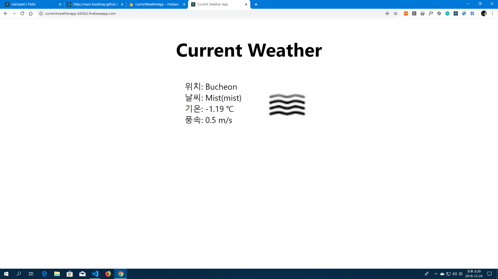

# Current Weather App

> Development environment

- OS: Windows
- IDE: VS Code
- Language: JavaScript
- Library: React.JS

> Use Open API

- OpenWeatherMap

> Development Platform

- Firebase

# Information
 > Location based real time weather web app
  - Site URL : https://currentweatherapp-b65b2.firebaseapp.com/

